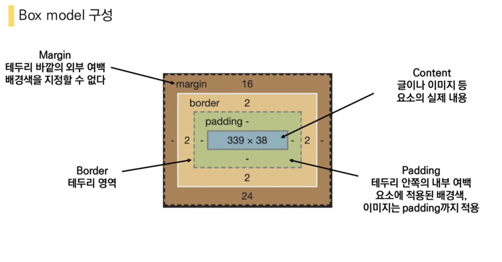
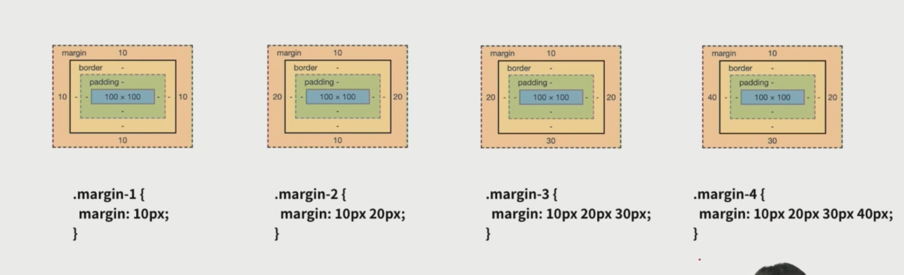
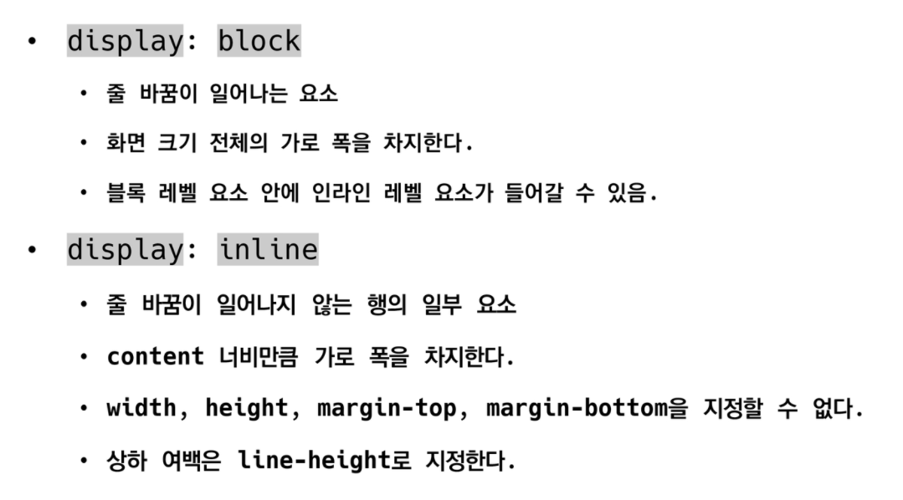
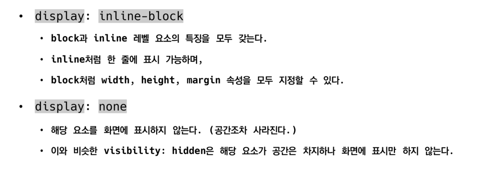
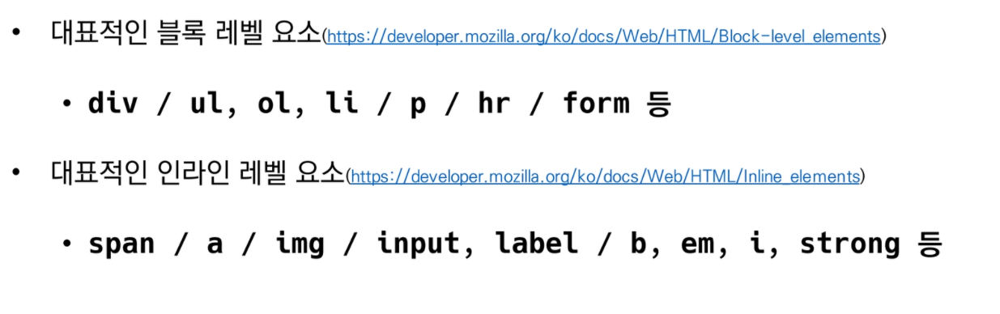
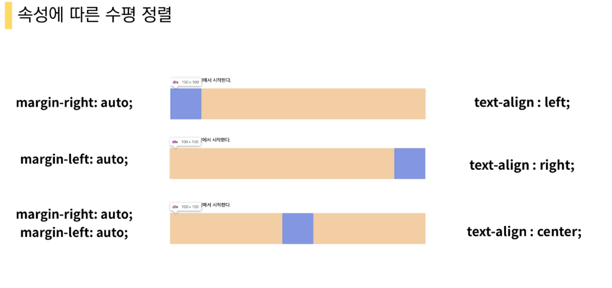
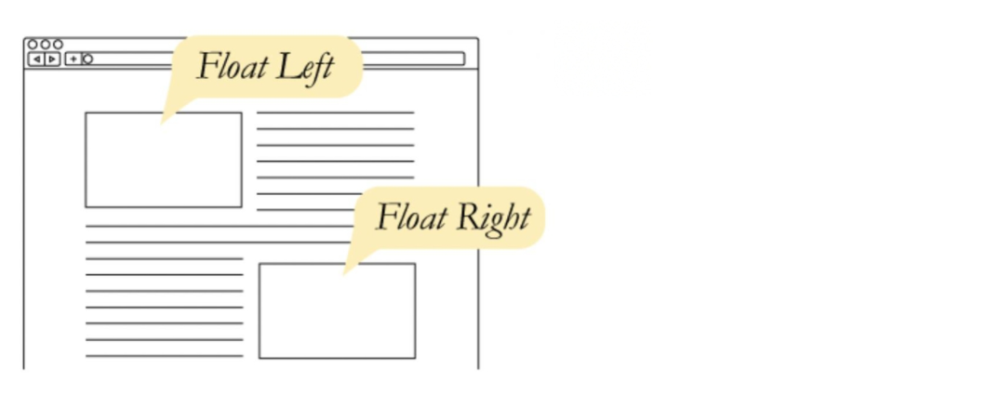
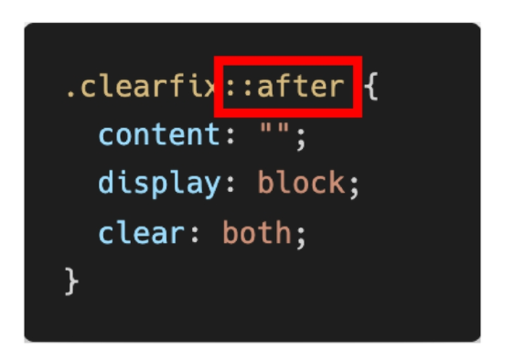
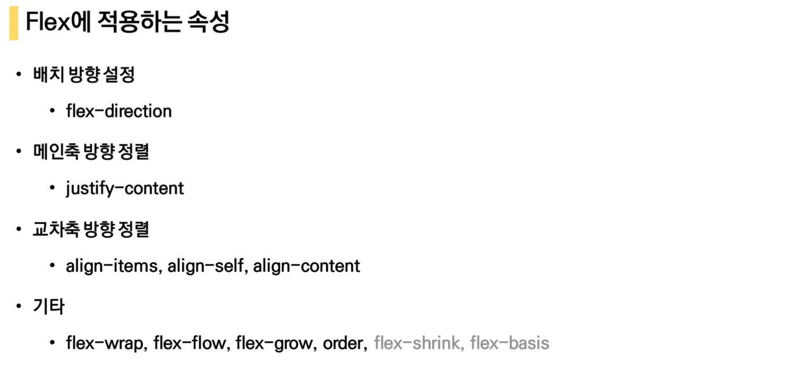
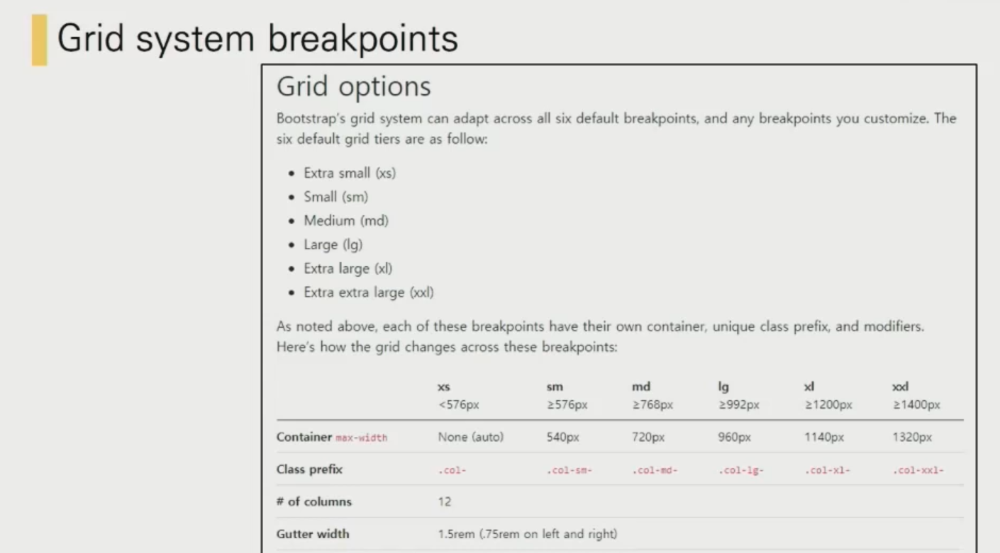

# WEB 정리


## HTML

> **Hyper Text** Markup Language

웹 페이지를 작성하기 위한 언어 **'의미'와 '구조'**를 정의


* Markup Language 

   특정 텍스트에 역할을 부여하는것 ex)h1,h2, 등

  프로그래밍 언어와는 다르게 단순하게 데이터를 표현하기만한다, (저장,조건,반복 x)

  ex) HTML, Markdown


## HTML의 기본구조


<meta> 태그를 페이스북에서 만들고 링크에 따른 제목,설명,사진 등 대략적인 정보 표기
    
</meta>


### HTML의 요소

* 여는태그/닫는태그 존재

* 내용이 없는태그도 존재 (br, hr, img,  input, limk, meta)

* **요소는 중첩이 가능, 오류를 반환하진않고 레이아웃기 깨진상태로 출력, 디버깅이 어려움**


### HTML의 속성

<a href="주소"></a> 경로,크기 등 정보 제공 보통 키값과 밸류 쌍으로 존재


#### 시멘틱 태그

* 시맨틱 태그 (div의 기능을 나눈것 이름적 의미만 있고 기능은 x)

  header : 문서 전체나 섹션의 헤더

  nav : 네비게이션

  aisde: 사이드에 위치한 공간

  section: 문서의 일반적인 구분

  article: 문서,페이지 사이트 안에 독립적으로 구분되는 영역

  footer: 문서 전체나 섹션의 마지막 부분

> **의미있는 정보의 그룹을 태그로 표현한것. ** ex) h1,table도 시맨틱 태그로 볼 수 있음.
>
> **코드의 가독성을 높이고 유지보수를 쉽게함.** 
>
> **단순히 구역을 나누는 것 뿐만 아니라 '의미'를 가지는 태그들을 활용하기 위한 노력**


#### 시멘틱 웹

> 웹 상에 존재하는 수많은 웹페이지들에 메타데이터를 부여하여 기존의 **단순한 데이터의 집합**이었던
>
> 웹페이지를 **의미와 관련성**을 가지는 거대한 데이터 베이스로 구축하고자 하는 발상


## HTML 문서 구조화


##### 인라인/ 블록요소

##### 그룹 컨텐츠 <p> <hr> <ol> <ul> <div> etc 

##### 텍스트 관련 요소 <a> <b> 굵게  <strong> <span><div> <br> 엔터 <i>  이미지 <em> etc

##### 테이블태그 <tr> <td> etc

#### form태그

서버에서 처리될 데이터를 제공하는 역할

* action -> 어디로 보낼지
* method 

#### input태그 -> 닫는태그가 없음

사용자의 입력값을 받는 태그

<label> : 서식 입력 요소의 캡션


label -> 체크박스를 안눌러도 눌림 (인라인요소 <br을 통해 줄내림)

required 값 입력 안하면 제출이 안됨

checked 기본사항

autofocus 자동입력

submit -> 서버로 데이터를 제출


## CSS

>  Cascading Style sheets

* 같은언어가 아닌 **각각 별개의 언어**

* 사용자에게 html이 어떻게 보일지 **스타일,레이아웃** 등을통해 HTML을 표시하는 방법을 지정하는 언어

선택자

```css
h1 {

color : blue;      <- 선언  속성과 값 쌍

font-size: 15ps;

}
```

##### css 정의 방법

1. 인라인
2. 내부참조
3. 외부참조


* 인라인 

   해당 태그에 직접 style속성 활용

* 내부참조

   head태그 내에 <style>에 지정

* 외부참조

  <link>태그를 통해 외부 css파일을 불러오기


주로사용하는 속성


#### 선택자

* html 문서에서 특정 요소를 선택하여 스타일링 하기위해 선택자라는 개념이 필요

> 기본선택자,결합자,의사클래스/구조적 의사 클래스


##### ( h2 ) 요소 선택자 

​	HTML 태그를 직접 선택 

#####  (*) 전체 선택자 

##### (.class명) 클래스선택자

​	마침표(.)로 시작하며 해당 클래스가 적용된 모든 항목 선택

##### (#id이름) id 선택자

​	(#) 문자로 시작하며 해당 아이디가 적용된 모든 항목을 선택

​	일반적으로 하나의문서에 1번만 사용 (여러번 사용해도 되지만 한번만 사용하는것을 권장)

##### (.클래스이름 > p) 자식결합자

클래스 아래에 P태그 하나만 속성 적용

##### (.클래스이름 p) 자손 결합자 

클래스 아래애 모든 P 태그에 속성 적용

**일반 형제 결합자**  P ~ span  p태그 이후 모든 ~ span 태그요소

**인접 형제 결합자**  P + span  바로뒤에 위치하는 span태그 요소 선택


#### CSS적용 우선순위

1. 중요도  
   * !important
2. 우선순위
   * 인라인 > id선택자 > calss선택자 > 요소선택자
3. 소스순서


#### CSS 상속

* CSS는 상속을 통해 부모 요소의 속성을 자식에게 상속

  상속 되는 것 - TEXT 관련요소

  상속 되지 않는 것 BOX model 관련 요소 ex) borde,  padding,  **width**,  margin ....ext

  ​	 position 관련 요소  ex) position 등


#### css 단위

크기단위

* **px**   모니터 해상도인 픽셀을 기준, 
* **%**    백분율 단위

* **em**   상속의 영향 받음, 상대적인 사이즈
* **rem**   상속영향x 최상위 요소 사이즈 기준으로 배수 단위를 가짐

* **viewport** 웹페이지를 방문한 웹컨텐츠의 영역


색상단위

색상키워드,RGB색상, HSL색상 (색상,채도,명도)


#### BOX model





​				상하좌우							상하/좌우 								상/좌우/하 						상/우/좌/하  


> 박스 사이즈를 맞추기 위하여  box-sizing: border-box; 


#### 마진 상쇄

**block A의 top과 block B의 bottom에 적용된 각각의 마진중 큰 마진 값으로 결합되는 현상**


### CSS Display

인라인/블록 요소









#### none과 hidden의 차이점

*  **hidden 은 공간은 차지하고있지만 none은 공간이 사라짐(다른 레이아웃에 영향)**

  ​	**★visibility: hidden;**  


### CSS Position

* 위치 조절할 수 있는 4가지

* **static** : 모든 태그의 기본값

* **relatice** : 상대적위치

  > 자기 자신의 static 위치를 기준으로 이동

* **absolute** : 절대적위치

  > **static이 아닌** 가장 가까운 부모/조상을 기준으로 이동, 없으면 body에 붙는 형태
  >
  > 원래 위치해 있었던 과거 위치에 있던 공간은 더이상 존재하지 않음

* **fixed** : 고정 위치

  > 스크롤시에도 항상 같은 곳에 위치
  >
  > 화면/뷰포트 기준으로 이동


# 1일차 HW/WS


#### * 이미지 +링크

```
  <a href="https://www.ssafy.com/">
    
  </a>
```


#### * nth-child()와 nth-of-type()의 차이점

nth-child(n) 부모 엘리먼트의 **모든** 자식 엘리먼트중 n번째

nth-of-type(n) 부모 엘리먼트의 **특정** 자식 엘리먼트중 n번째


#### * 절대경로와 상대경로

**절대경로**

어떠한 웹페이지나 파일이 가지고 있는 고유한 경로

http://www.google.com, C:\users\document\untitled.jpg

**상대경로**

현재 위치한 경로로부터 그곳의 위치

> **이미지 위치가 바뀌어도 상대경로로 경로를 저장하면 사진이뜬다!!**


### Float



#### 속성 

* none: 기본값
* left: 요소를 왼쪽으로 띄움
* right: 요소를 오른쪽으로 띄움


# Flex box


> ### Float clear

* 선택한 요소의 맨 마지막 자식으로 가상요소 생성

  clearfix::affter

  



#### 

**justify -> 메인축 정렬**

**align   -> 교차축 정렬**

**content -> 여러줄**

**items -> 한줄**

**self -> flex item 개별요소**

ex) justify-content : 메인축 기준 여러줄 정렬

​	  align-items : 교차축 기준 한줄 정렬

​	  align-self : 교차축 기준 선택한 요소 하나 정렬


# Bootstrap

.mx-auto  수평 중앙 정렬


##### 반응형 웹 Responsive web design


### Grid system

flexbox로 제작됨.

12개의 column 6개의 grid breakpoints 존재



  


### 3일차 hw


1. CSS flex-direction Flex box의 주축을 변경하는 flex-direction의 4가지 값과 각각의 특징을 작성하시오

   row

   주축이 좌에서 우로 행을 따른다. ->

   row-reverse

   주축이 우에서 좌로 행을 따른다. <-

   column

   주축이 페이지상단에서 하단으로 방향을 따른다.

   column-reverse

   주축이 페이지하단에서 상단으로 방향을 따른다.

   

2. Bootstrap flex-direction flex-direction의 4가지 요소와 대응하는 bootstrap 클래스를 작성하시오

   d-flex


3. align-items align-items 속성의 4가지 값과 각각의 특징을 작성하시오

   flex-start : 아이템들을 시작점으로 정렬

   flex-end : 아이템들을 끝으로 정렬

   center : 아이템들을 가운데로 정렬

   stretch : 아이템들이 수직축 방향으로 끝까지 쭈욱 늘어난다.

   baseline : 아이템들을 텍스트 베이스라인 기준으로 정렬

   ​	

4. flex-flow   - flex-direction, flex-wrap


5.  Bootstrap grid system

   ```html
   <div class= 'container'>
       <div class='row'>
           <div class="col-xl-6"></div>
       </div>
   </div>
   ```

   

   xs: 576px 이하에서 세로로 표시시작

   sm:576px 이상에서 세로로 표시시작

   md:768px 이상에서 세로로 표시시작

   lg: 992px이상에서 세로로 표시 시작

   xl: 1200px 이상에서 세로로 표시 시작

   xxl:1400px 이상에서 세로로 표시 시작

   

   1-12

   12분할로 나누어진  그리드에 해당 숫자만큼 분할


#### offset - > 앞 칸 비우기